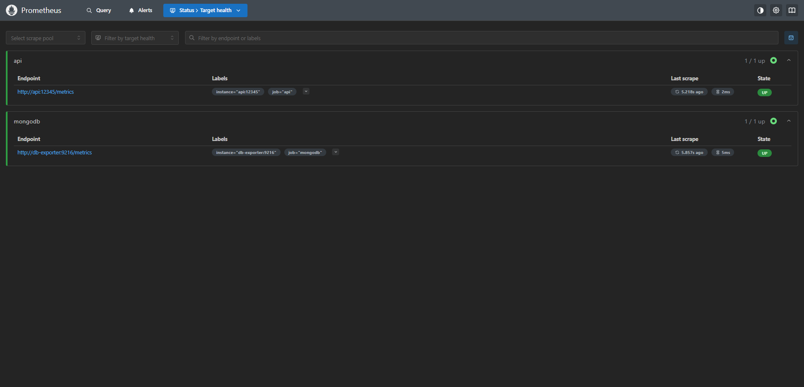
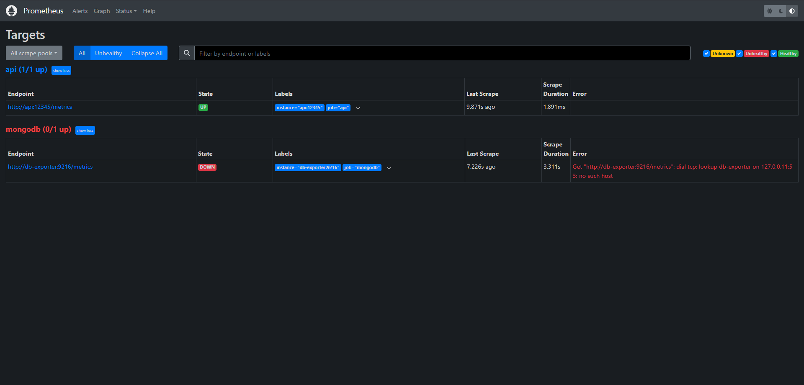
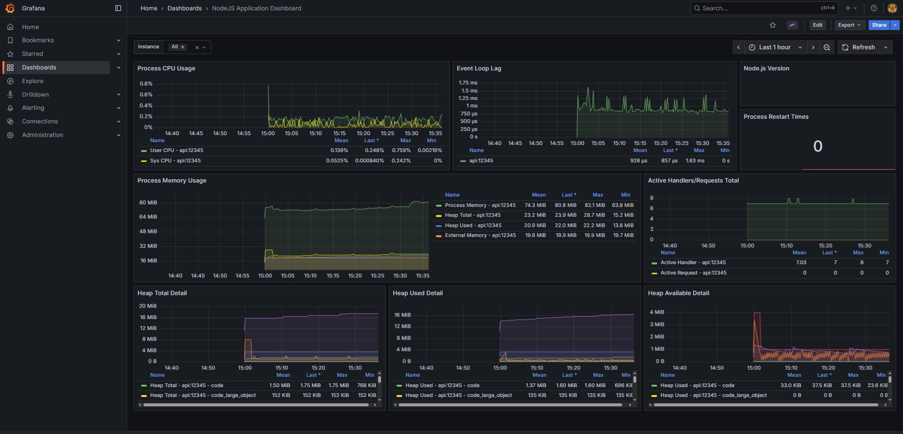
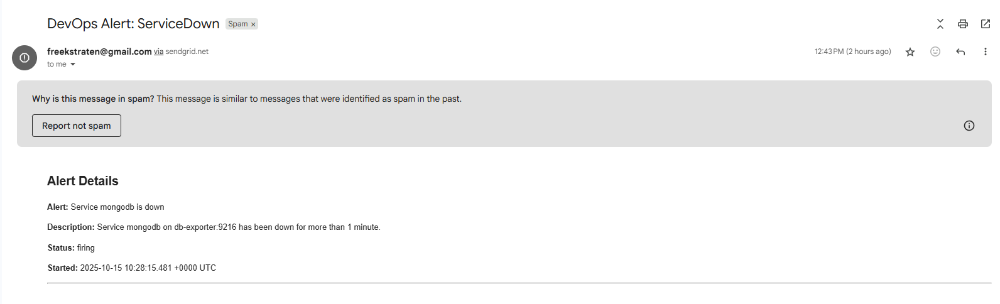

# OpsFlow Microstack (DevOps • 2 EC)

<!-- Build status badges (application) -->
[](https://github.com/FreekStraten/opsflow-microstack-2025/actions/workflows/CI-API.yml)
[](https://github.com/FreekStraten/opsflow-microstack-2025/actions/workflows/CI-LINT.yml)
[](https://github.com/FreekStraten/opsflow-microstack-2025/actions/workflows/CI-NOTIFICATION.yml)

---

<!-- Tech badges (languages & tools) -->


Kleine maar complete DevOps‑omgeving met Node.js API, MongoDB, monitoring (Prometheus/Grafana) en CI via GitHub Actions.

## Doel

Meerdere services (API, database, monitoring) werken samen met reproduceerbare deployment via Docker Compose, automatische tests/linting en observability.

## Tech stack

Node.js • Express • MongoDB • Docker Compose • Prometheus • Grafana • ESLint • Jest • GitHub Actions

## Projectstructuur

```
api/                      # Express + MongoDB service
  routes/
  services/database.js
  app.js                  # + Prometheus metrics middleware
  package.json
docker-compose.yml        # API + DB + Monitoring stack
monitoring/
  prometheus/prometheus.yml
  grafana/
    provisioning/         # Datasource & dashboard config
    dashboards/
docs/                     # Screenshots & README assets
```

## Quick Start

Vereisten:
- Docker Desktop (v4.30+)
- NodeJS 20+ (alleen nodig voor lokale ontwikkeling)
- Poorten: 3000 (API), 8080 (Frontend), 9090 (Prometheus), 3100 (Grafana), 9093 (Alertmanager)

1) Clone repo
```
git clone https://github.com/FreekStraten/opsflow-microstack-2025.git
cd opsflow-microstack-2025
```

2) Start volledige omgeving
```
docker compose up -d
```

3) Open services

| Service | URL | Opmerking |
|--------|-----|-----------|
| API | http://localhost:3000/users | REST-endpoint (+ /metrics) |
| Frontend | http://localhost:8080 | Proxy naar API; ook /users werkt |
| Prometheus | http://localhost:9090/targets | Targets moeten UP zijn |
| Grafana | http://localhost:3100 | Inloggen met admin‑credentials uit `.env` |
| Alertmanager | http://localhost:9093 | Test alerts via API |

4) Stoppen
```
docker compose down
```

## CI Workflows

Workflows draaien bij push/PR op `main`. Handmatig triggeren kan via de Actions tab (workflow_dispatch is ingeschakeld).

Lokaal ontwikkelen/testen:
```
npm ci
npm test
npm run lint
```

## Monitoring

- API geïnstrumenteerd met `express-prom-bundle` → Prometheus scrapet de API.
- MongoDB metrics via mongodb‑exporter.

Screenshots:

- Prometheus targets: 
- Prometheus targets (DOWN voorbeeld): 
- Grafana dashboard: 

## E‑mail alerts (SendGrid)

Bij gebruik van SendGrid:
- `SMTP_AUTH_USERNAME` is altijd `apikey`
- `SMTP_AUTH_PASSWORD` is je SendGrid API key
- `SMTP_FROM` moet een geverifieerde afzender zijn (Single Sender of Domain Auth)
- `ALERT_EMAIL_TO` is de ontvanger

Voorbeeld alert e-mail (service down):



## Licentie

MIT — zie `LICENSE`.

## Security & Disclaimer

- Dit project is “as‑is” en bedoeld voor educatieve/demo‑doeleinden; niet voor productie.
- Geen SLA of garantie op (tijdige) security fixes of responses.
- Gebruik op eigen risico. Afgeleide projecten/gebruik buiten deze repo vallen buiten scope.
- Meld kwetsbaarheden bij voorkeur privé via GitHub Security Advisories (of open een PR met een voorstel tot fix zonder exploitdetails).
- Zie ook `SECURITY.md` voor de volledige policy.
